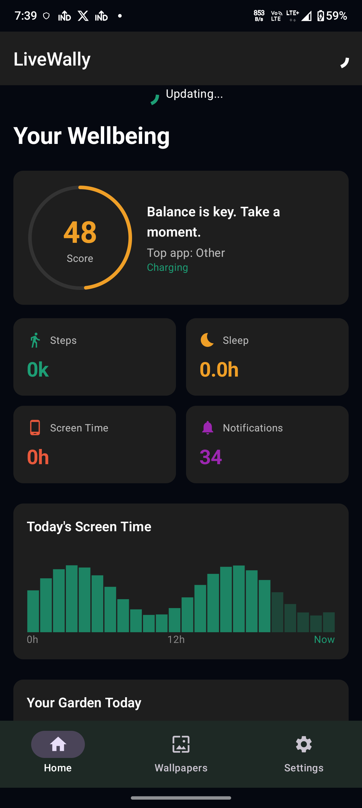
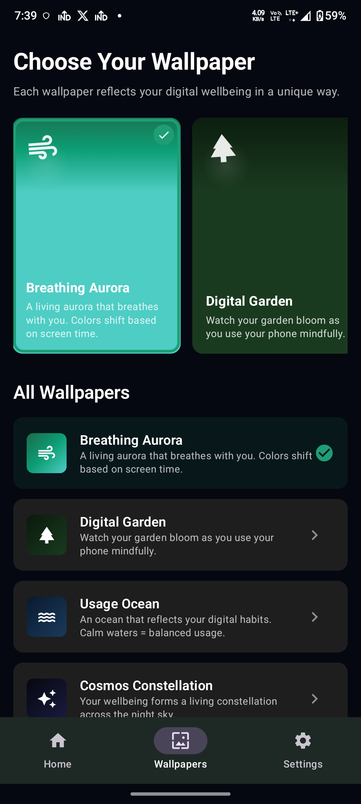
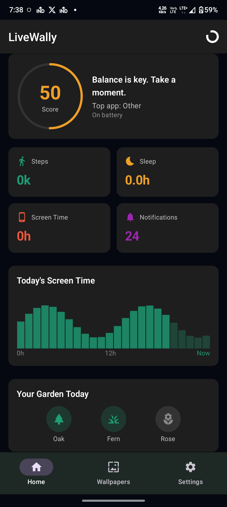

# LiveWally - Digital Wellbeing Live Wallpaper

A production-quality Android live wallpaper experience built with Kotlin, MVVM + Clean Architecture, Jetpack Compose, and Hilt. LiveWally turns your home screen into a reflection of your digital wellbeing through six animated wallpaper worlds.

## Screenshots

| Dashboard | Wallpaper Picker | Home |
|-----------|------------------|------|
|  |  |  |

## Features

### 6 Animated Live Wallpapers

1. **Breathing Aurora** — Colors shift by usage health: teal-green for healthy usage, amber for moderate, rose-red for heavy.
2. **Digital Garden** — Plants bloom based on mindful usage, activity, and sleep behavior.
3. **Usage Ocean** — Tide height mirrors screen time; wave amplitude reflects notifications; storm clouds appear when overwhelmed.
4. **Cosmos Constellation** — 7-day history forms a night sky; stars connect good days; shooting stars mark personal bests.
5. **Mindful Forest** — Fog density changes with distraction; light rays appear with high wellbeing; birds fly with activity.
6. **Wellbeing Clock** — Practical clock wallpaper with wellbeing-aware visual treatment.

### App Experience

- **Dashboard** — Wellbeing score ring, steps/sleep/screen time/notifications metrics, today's screen time chart, and garden preview.
- **Wallpaper Picker** — Horizontal preview cards, full list view, preview dialog, and one-tap wallpaper setting.
- **Settings** — Permission guide, frame rate control, battery saver mode, step/screen time/sleep goals, and bedtime mode.

## Architecture

```
app/
├── data/           # Data layer
│   ├── local/      # Room DB, DataStore
│   ├── repository/ # Repository implementations
│   └── source/     # Health Connect, Usage Stats, Notifications, Sensors
├── domain/          # Business logic
│   ├── model/       # WellbeingSnapshot, enums
│   ├── repository/  # Repository interfaces
│   └── usecase/    # Use cases
├── wallpaper/      # Live wallpaper services
│   ├── base/       # BaseWallpaperService, BaseWallpaperEngine
│   ├── breath/     # Breathing Aurora
│   ├── garden/     # Digital Garden
│   ├── ocean/      # Usage Ocean
│   ├── cosmos/     # Cosmos Constellation
│   ├── forest/     # Mindful Forest
│   └── clock/      # Wellbeing Clock
├── ui/             # Compose UI
│   ├── dashboard/  # Main wellbeing dashboard
│   ├── wallpaper/  # Wallpaper picker
│   └── settings/   # App settings
└── di/             # Hilt modules
```

## Tech Stack

- **Language**: Kotlin
- **Architecture**: MVVM + Clean Architecture
- **DI**: Hilt
- **Async**: Kotlin Coroutines + Flow
- **UI**: Jetpack Compose + Material 3
- **Drawing**: Android Canvas / Compose Graphics
- **Background**: WorkManager
- **Storage**: DataStore Preferences + Room
- **Build**: Gradle
- **Target SDK**: 35
- **Min SDK**: 30

## Permissions

### Required

| Permission | Purpose |
|------------|---------|
| `PACKAGE_USAGE_STATS` | Track screen time and app usage |

### Optional

| Permission | Purpose |
|------------|---------|
| `BIND_NOTIFICATION_LISTENER_SERVICE` | Notification tracking |
| `POST_NOTIFICATIONS` | Wellbeing milestone alerts |
| Health Connect permissions | Steps, sleep, heart rate |
| `ACTIVITY_RECOGNITION` | Fallback step counting |

## Google Play Store Preparation

This repository contains all artifacts needed for Google Play Store submission:

- **PRIVACY_POLICY.md** — Privacy policy template
- **RELEASE_NOTES.md** — Version release notes
- **GOOGLE_PLAY_PREP.md** — Complete submission checklist
- **signing/signing-config.properties.example** — Release signing template

## Setup

```bash
git clone https://github.com/govindtank/livewally.git
cd livewally
./gradlew assembleDebug
adb install -r app/build/outputs/apk/debug/app-debug.apk
```

## Building for Release

1. Copy `signing/signing-config.properties.example` to `signing/signing-config.properties`
2. Fill in your keystore details
3. Build: `./gradlew assembleRelease`
4. Sign with `apksigner` or upload to Play Console as an App Bundle

## License

MIT
